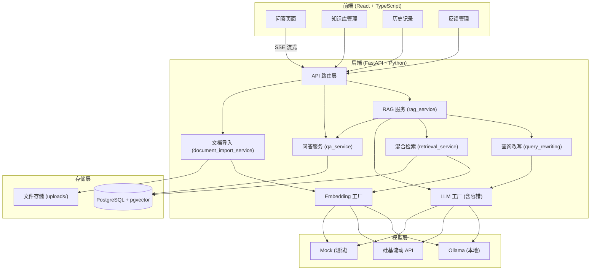
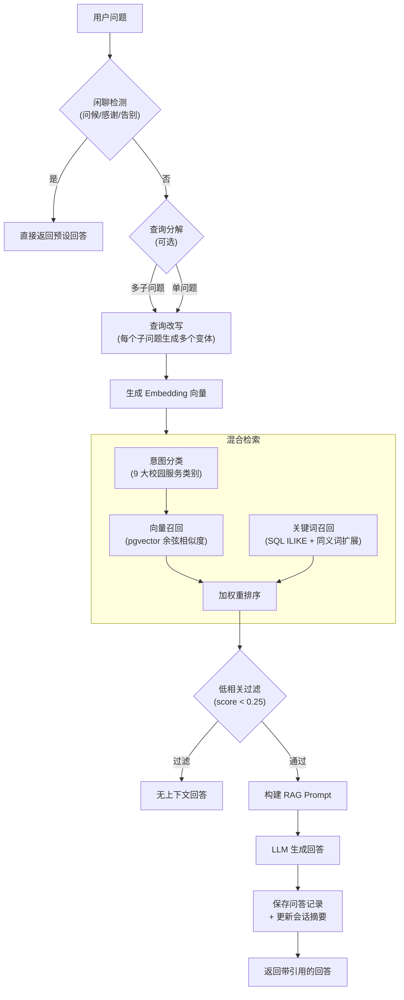

# 高校校园服务智能问答系统

一个面向高校校园服务场景的 RAG（Retrieval-Augmented Generation）智能问答系统。系统先从校园知识库中检索相关条目，再将检索结果作为上下文交给大语言模型生成回答，避免模型脱离事实自由发挥。

当前版本默认公开开放业务功能：所有访问者都可以使用智能问答、知识库管理、文档上传分块和反馈功能。注册/登录接口仍保留，用于展示用户身份，但不是使用系统的前置条件。

---

## 系统架构



### RAG 检索流程



**混合检索详细流程：**

1. **意图分类**：根据问题关键词识别校园服务分类（教务、宿舍、校园卡、图书馆、网络等），优先检索对应知识库
2. **向量召回**：使用 Embedding 模型生成问题向量，通过 pgvector 做余弦相似度检索（默认 12 条候选）
3. **关键词召回**：对标题、分类、正文、来源做 SQL ILIKE 匹配，支持同义词扩展（默认 12 条候选）
4. **加权重排序**：`score = vector_similarity × 0.50 + keyword_score × 0.35 + category_boost × 0.15`
5. **低相关过滤**：无分类、无关键词、语义相似度也偏低的问题返回无上下文，避免无关知识干扰
6. **去重合并**：按 ID 合并候选，保留最高分
7. **返回 Top-K**：默认 K=5，附带引用编号、相关度分数和命中原因

---

## 技术栈

### 后端

| 组件 | 技术 |
|------|------|
| 语言 | Python 3.10+ |
| Web 框架 | FastAPI + Uvicorn |
| ORM | SQLAlchemy 2.0+ |
| 数据校验 | Pydantic v2 (pydantic-settings) |
| 数据库 | PostgreSQL 16 + pgvector |
| HTTP 客户端 | httpx (异步) |
| 认证 | python-jose (JWT) + passlib (bcrypt) |
| 文档解析 | pypdf (PDF)、python-docx (Word) |
| 数据库迁移 | Alembic |
| 测试 | pytest |

### 前端

| 组件 | 技术 |
|------|------|
| 语言 | TypeScript |
| 框架 | React 18 |
| 构建工具 | Vite 6 |
| UI 组件库 | Ant Design 5 |
| 路由 | react-router-dom 6 |
| HTTP 客户端 | Axios (含 Token 拦截器) |
| Markdown 渲染 | react-markdown + remark-gfm |
| 流式通信 | SSE (Server-Sent Events) |

---

## 模型配置

系统支持三种模型提供方，通过 `backend/.env` 环境变量切换。LLM 和 Embedding 可独立配置。

### 问答模型 (LLM)

通过 `MODEL_PROVIDER` 环境变量配置：

| 提供方 | 模型 | 说明 |
|--------|------|------|
| `local` | `qwen2.5:7b` / `qwen3.5:9b` | 通过 Ollama 本地部署，适合有 GPU 的机器 |
| `siliconflow` | `Qwen/Qwen2.5-7B-Instruct` | 通过硅基流动 API 调用，无需本地 GPU |
| `mock` | 无 | 基于规则的模板回答，用于开发测试 |

**本地 Ollama 配置示例：**

```env
MODEL_PROVIDER=local
LOCAL_LLM_BASE_URL=http://localhost:11434
LOCAL_LLM_MODEL=qwen3.5:9b
```

**硅基流动配置示例：**

```env
MODEL_PROVIDER=siliconflow
SILICONFLOW_API_KEY=your_api_key_here
SILICONFLOW_BASE_URL=https://api.siliconflow.cn/v1
SILICONFLOW_CHAT_MODEL=Qwen/Qwen2.5-7B-Instruct
```

### Embedding 模型

通过 `EMBEDDING_PROVIDER` 环境变量配置：

| 提供方 | 模型 | 维度 | 说明 |
|--------|------|------|------|
| `local` | `nomic-embed-text` / `qwen3-embedding:8b-fp16` | 768 / 4096 | 通过 Ollama 本地部署 |
| `siliconflow` | `BAAI/bge-m3` | 1024 | 通过硅基流动 API 调用 |
| `mock` | 无 | 可配置 | 基于 SHA-256 哈希的确定性向量 |

**本地 Ollama 配置示例：**

```env
EMBEDDING_PROVIDER=local
LOCAL_EMBEDDING_BASE_URL=http://localhost:11434
LOCAL_EMBEDDING_MODEL=nomic-embed-text
EMBEDDING_DIMENSION=768
```

**硅基流动配置示例：**

```env
EMBEDDING_PROVIDER=siliconflow
SILICONFLOW_EMBEDDING_MODEL=BAAI/bge-m3
EMBEDDING_DIMENSION=1024
```

### 容错机制

系统内置模型容错机制（`FaultTolerantLLMClient`）：

- **健康追踪**：连续 3 次调用失败后标记为不健康，5 分钟后自动重试
- **降级链**：主模型 → 备选提供方 → 规则兜底（`FallbackLLMClient`）
- 通过 `ENABLE_FAULT_TOLERANCE=true` 启用（默认启用）
- 通过 `MODEL_HEALTH_CACHE_TTL` 配置健康状态缓存时间

### 切换模型后的注意事项

切换 Embedding 模型时，需要同步修改 `EMBEDDING_DIMENSION` 并重建向量：

```bash
cd backend
python -m app.scripts.rebuild_knowledge_embeddings
python -m app.scripts.init_db
```

---

## 功能模块

### 1. 智能问答

- 多轮对话，自动管理会话上下文
- SSE 流式响应，实时展示回答
- 查询分解：将复杂多问题拆分为独立子问题
- 查询改写：为每个子问题生成多个检索变体
- 混合检索：向量召回 + 关键词召回 + 意图分类
- 闲聊检测：问候、感谢、告别等直接返回预设回答，不消耗模型资源
- 带引用回答：附带相关度分数和命中原因
- 模型健康监控与自动故障转移

### 2. 知识库管理

- 知识条目的增删改查
- 文档导入：支持 PDF、DOCX、Markdown
- 4 种分块策略：`fixed_size`（固定长度）、`paragraph`（按段落）、`markdown_heading`（按标题）、`full_document`（整篇）
- 可配置切片大小和重叠长度
- 自动向量化：创建/更新知识条目时自动生成 Embedding
- 9 大预设校园服务分类
- 内置 90 条校园服务种子数据

### 3. 会话历史

- 基于会话（Session）的对话记录管理
- 会话归档 / 恢复 / 删除
- 搜索和筛选
- 分页支持

### 4. 反馈系统

- 对问答记录点赞 / 点踩
- 可选文字评论
- 反馈列表查看

### 5. 用户认证

- JWT 认证（注册 / 登录）
- bcrypt 密码哈希
- 前端路由守卫（无 Token 跳转登录页）
- 认证为可选功能，不影响核心问答使用

### 6. 文档处理

- PDF 文本提取（支持加密 PDF）
- DOCX 文本提取（段落 + 表格）
- Markdown 解析（标题感知分块）
- UUID 前缀文件名 + 日期目录存储

---

## 数据库表结构

系统使用 PostgreSQL + pgvector，共 5 张表：

### `users` — 用户表

| 字段 | 类型 | 说明 |
|------|------|------|
| `id` | Integer (PK) | 主键 |
| `username` | String (unique) | 用户名 |
| `hashed_password` | String | 加密密码 |
| `nickname` | String | 昵称 |
| `created_at` | DateTime | 创建时间 |

### `knowledge_base` — 知识库表

| 字段 | 类型 | 说明 |
|------|------|------|
| `id` | Integer (PK) | 主键 |
| `title` | String | 知识标题 |
| `category` | String | 分类（9 大校园服务类别） |
| `content` | Text | 知识内容 |
| `source` | String | 来源 |
| `document_name` | String | 导入文档名 |
| `document_path` | String | 文档存储路径 |
| `chunk_index` | Integer | 切片序号 |
| `chunk_total` | Integer | 总切片数 |
| `chunking_method` | String | 分块方法 |
| `embedding` | Vector | 向量（维度由 `EMBEDDING_DIMENSION` 决定） |
| `created_at` | DateTime | 创建时间 |
| `updated_at` | DateTime | 更新时间 |

### `conversation_sessions` — 会话表

| 字段 | 类型 | 说明 |
|------|------|------|
| `id` | Integer (PK) | 主键 |
| `title` | String | 会话标题 |
| `summary` | Text | 会话摘要（LLM 自动更新） |
| `round_count` | Integer | 对话轮次 |
| `status` | String | 状态：`active` / `archived` |
| `created_at` | DateTime | 创建时间 |
| `updated_at` | DateTime | 更新时间 |

### `qa_records` — 问答记录表

| 字段 | 类型 | 说明 |
|------|------|------|
| `id` | Integer (PK) | 主键 |
| `session_id` | Integer (FK) | 关联会话 ID |
| `question` | Text | 用户问题 |
| `answer` | Text | 模型回答 |
| `retrieved_context` | JSON | 检索到的知识上下文 |
| `model_provider` | String | 使用的模型提供方 |
| `status` | String | 状态：`active` / `archived` |
| `created_at` | DateTime | 创建时间 |
| `updated_at` | DateTime | 更新时间 |

### `feedback` — 反馈表

| 字段 | 类型 | 说明 |
|------|------|------|
| `id` | Integer (PK) | 主键 |
| `qa_record_id` | Integer (FK) | 关联问答记录 ID（CASCADE 删除） |
| `rating` | String | 评分：`like` / `dislike` |
| `comment` | Text | 评论（可选） |
| `created_at` | DateTime | 创建时间 |

---

## 快速启动

### 前置条件

- Python 3.10+
- Node.js 18+
- Docker

### 第一步：启动数据库

```bash
docker compose up -d postgres
```

这会启动 `pgvector/pgvector:pg16` 镜像，默认端口 5432。如果端口被占用：

```bash
set POSTGRES_PORT=5433
docker compose up -d postgres
```

并同步修改 `backend/.env` 中 `DATABASE_URL` 的端口。

### 第二步：后端环境

```bash
cd backend
python -m venv .venv
.venv\Scripts\activate          # Windows
# source .venv/bin/activate    # macOS/Linux
pip install -r requirements.txt
copy .env.example .env          # Windows
# cp .env.example .env          # macOS/Linux
```

### 第三步：配置模型

编辑 `backend/.env`，按需配置模型提供方。开发测试可使用 mock 模式：

```env
MODEL_PROVIDER=mock
EMBEDDING_PROVIDER=mock
```

### 第四步：初始化数据库

```bash
cd backend
python -m app.scripts.init_db
python -m app.scripts.seed_knowledge
```

这会创建所有数据库表、启用 pgvector 扩展、并导入 90 条校园服务种子数据。

### 第五步：启动后端

```bash
cd backend
uvicorn app.main:app --reload --host 0.0.0.0 --port 8000
```

健康检查：

```bash
curl http://localhost:8000/api/health
# 返回: {"status":"ok"}
```

### 第六步：启动前端

```bash
cd frontend
npm install
npm run dev
```

打开 http://localhost:5173。

---

## API 接口

### 问答

**`POST /api/qa/ask`** — 同步问答

```json
{
  "question": "校园卡丢了怎么办？",
  "session_id": 1
}
```

`session_id` 可选，不传时自动创建新会话。

**`POST /api/qa/ask/stream`** — 流式问答（SSE）

请求格式同上，返回 `text/event-stream`。

**响应示例：**

```json
{
  "answer": "根据知识库，校园卡丢失后应立即挂失...",
  "qa_record_id": 1,
  "session_id": 1,
  "conversation_summary": "用户正在咨询校园卡挂失流程。",
  "retrieved_context": [
    {
      "id": 1,
      "title": "校园卡挂失流程",
      "category": "校园卡服务",
      "content": "校园卡丢失后...",
      "source": "校园卡服务中心",
      "citation_index": 1,
      "relevance_score": 0.92,
      "match_reason": "分类匹配、关键词命中、语义相似"
    }
  ],
  "model_provider": "local"
}
```

### 会话管理

- `GET /api/qa/sessions` — 会话列表（支持 `status`、`skip`、`limit` 参数）
- `GET /api/qa/sessions/{id}/records` — 获取会话下的所有问答记录
- `PUT /api/qa/sessions/{id}/archive` — 归档会话
- `DELETE /api/qa/sessions/{id}` — 删除会话

### 知识库

- `GET /api/knowledge` — 知识列表
- `POST /api/knowledge` — 创建知识条目
- `POST /api/knowledge/import` — 上传文档导入知识库（支持 PDF/DOCX/Markdown）
- `GET /api/knowledge/{id}` — 获取知识详情
- `PUT /api/knowledge/{id}` — 更新知识条目
- `DELETE /api/knowledge/{id}` — 删除知识条目

### 文档导入

`POST /api/knowledge/import`

表单字段：

| 字段 | 说明 |
|------|------|
| `file` | 上传文件（`.pdf`、`.docx`、`.md`） |
| `category` | 知识分类 |
| `source` | 来源名称 |
| `chunking_method` | 分块方式：`fixed_size`、`paragraph`、`markdown_heading`、`full_document` |
| `chunk_size` | 切片大小，默认 1200 |
| `chunk_overlap` | 切片重叠长度，默认 150 |

### 反馈

- `POST /api/feedback` — 提交反馈
- `GET /api/feedback` — 反馈列表

### 认证

- `POST /api/auth/register` — 注册
- `POST /api/auth/login` — 登录

---

## 项目目录结构

```text
backend/
  app/
    api/routes/              # API 路由：auth、qa、knowledge、feedback
    core/
      config.py              # 环境变量配置 (Pydantic Settings)
      database.py            # 数据库连接 (SQLAlchemy)
      ai_errors.py           # AI 服务错误定义
    models/                  # SQLAlchemy ORM 模型
      user.py                #   用户表
      knowledge.py           #   知识库表
      conversation_session.py#   会话表
      qa_record.py           #   问答记录表
      feedback.py            #   反馈表
    schemas/                 # Pydantic 请求/响应模型
    services/                # 业务逻辑
      rag_service.py         #   RAG 核心编排
      retrieval_service.py   #   混合检索 + 重排序
      query_rewriting.py     #   查询分解 + 改写
      knowledge_service.py   #   知识库 CRUD
      qa_service.py          #   问答记录 + 会话管理
      document_import_service.py  # 文档解析 + 分块
      embedding/             #   Embedding 提供方
        base.py              #     抽象基类
        factory.py           #     工厂
        local_embedding.py   #     Ollama
        siliconflow_embedding.py  # 硅基流动
        mock_embedding.py    #     Mock
      llm/                   #   LLM 提供方
        base.py              #     抽象基类
        factory.py           #     工厂 (含容错)
        local_client.py      #     Ollama
        siliconflow_client.py#     硅基流动
        fallback_client.py   #     规则兜底
        fault_tolerant_client.py  # 自动故障转移
    scripts/                 # 初始化脚本
      init_db.py             #   建表 + pgvector 扩展
      seed_knowledge.py      #   导入 90 条种子数据
      reset_campus_data.py   #   清空并重建数据
      rebuild_knowledge_embeddings.py  # 重建向量
    data/
      campus_seed.py         #   90 条校园服务知识 (9 分类)
  tests/                     # 测试
  uploads/                   # 上传文件存储
frontend/
  src/
    api/                     # API 调用层 (Axios)
    components/              # 通用组件
      ChatBox.tsx            #   输入框
      MessageList.tsx        #   消息列表 (Markdown + 引用)
      HistorySidebar.tsx     #   历史会话侧边栏
      KnowledgeForm.tsx      #   知识表单
      KnowledgeTable.tsx     #   知识列表表格
    pages/                   # 页面
      ChatPage.tsx           #   问答页面
      KnowledgePage.tsx      #   知识库管理
      HistoryPage.tsx        #   历史记录
      FeedbackPage.tsx       #   反馈管理
      LoginPage.tsx          #   登录/注册
    types.ts                 # TypeScript 类型定义
    styles.css               # 全局样式
docker-compose.yml           # PostgreSQL + pgvector
```

---

## 常见问题

### 数据库连接失败

确认 PostgreSQL 容器已启动，并且 `backend/.env` 中的 `DATABASE_URL` 与 `docker-compose.yml` 一致。

### vector 扩展不存在

确认使用的是 `pgvector/pgvector:pg16` 镜像，并运行了 `python -m app.scripts.init_db`。

### 切换 Embedding 模型后写入失败

pgvector 列有固定维度。切换模型时需同步修改 `EMBEDDING_DIMENSION`，并执行：

```bash
python -m app.scripts.rebuild_knowledge_embeddings
python -m app.scripts.init_db
```

### 没有本地模型或 API Key 能不能运行

可以。设置为 mock 模式即可：

```env
MODEL_PROVIDER=mock
EMBEDDING_PROVIDER=mock
```

只要配置为 `local` 或 `siliconflow`，模型不可用时会明确报错，不会静默降级。

### Ollama 模型走 CPU 不走 GPU

确保 Ollama 版本支持你的 GPU 架构。对于 NVIDIA 50 系列显卡（Blackwell 架构），需要 Ollama 0.24.0+ 版本。可通过 `ollama ps` 命令检查 `PROCESSOR` 列是否显示 GPU。
