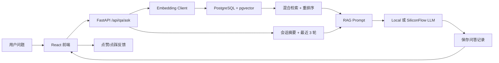

# 高校校园服务智能问答系统

一个面向高校校园服务场景的 RAG 智能问答 MVP。系统先从校园知识库检索相关条目，再把检索结果作为上下文交给模型生成回答，避免只靠模型自由发挥。

当前版本默认公开开放业务功能：所有访问者都可以使用智能问答、知识库管理、文档上传分块和反馈功能。注册/登录接口仍保留，用于展示用户身份，但不是使用系统的前置条件。

## 技术栈

- 后端：Python 3.10+、FastAPI、SQLAlchemy、Pydantic、httpx、Uvicorn
- 数据库：PostgreSQL、pgvector
- 前端：React、Vite、TypeScript、Axios、Ant Design
- 模型：本地 Ollama/HTTP 模型、硅基流动 API，均通过环境变量切换

## 系统架构



## 目录结构

```text
backend/
  app/
    api/routes/          # knowledge、qa、feedback 路由
    core/                # 配置和数据库连接
    models/              # SQLAlchemy 表模型
    schemas/             # Pydantic 请求/响应结构
    services/            # RAG、知识库、模型、embedding 服务
    scripts/             # 初始化数据库和示例数据
  tests/
frontend/
  src/
    api/
    components/
    pages/
docker-compose.yml
```

## 环境准备

1. 安装 Python 3.10+、Node.js 18+、Docker。
2. 启动数据库：

```bash
docker compose up -d postgres
```

如果本机 `5432` 已被占用，可以临时改用其他宿主机端口：

```bash
set POSTGRES_PORT=5433
docker compose up -d postgres
```

并同步把 `backend/.env` 中的 `DATABASE_URL` 端口改为 `5433`。

3. 准备后端环境：

```bash
cd backend
python -m venv .venv
.venv\Scripts\activate
pip install -r requirements.txt
copy .env.example .env
```

macOS/Linux 激活虚拟环境：

```bash
source .venv/bin/activate
```

## 数据库初始化

`pgvector/pgvector:pg16` 镜像已内置 pgvector。初始化脚本会执行：

```sql
CREATE EXTENSION IF NOT EXISTS vector;
```

运行：

```bash
cd backend
python -m app.scripts.init_db
python -m app.scripts.seed_knowledge
```

如果切换了 Embedding 模型或维度，`init_db` 会检查 `knowledge_base.embedding` 的 pgvector 维度。出现“需要重新构建知识库向量”提示时，先执行：

```bash
cd backend
python -m app.scripts.rebuild_knowledge_embeddings
python -m app.scripts.init_db
```

如需清空当前演示数据并重建一套完整的校园服务知识库，可运行：

```bash
cd backend
python -m app.scripts.reset_campus_data
```

该脚本会清空 `feedback`、`qa_records`、`knowledge_base`、`users` 表，删除 `backend/uploads` 下已上传文件，然后导入 9 个知识库分类、共 90 条校园服务知识。若只想保留已上传的原始文件，可加 `--keep-uploads`：

```bash
python -m app.scripts.reset_campus_data --keep-uploads
```

## 后端启动

```bash
cd backend
uvicorn app.main:app --reload --host 0.0.0.0 --port 8000
```

健康检查：

```bash
curl http://localhost:8000/api/health
```

返回：

```json
{"status":"ok"}
```

## 前端启动

```bash
cd frontend
npm install
npm run dev
```

打开 [http://localhost:5173](http://localhost:5173)。

如果后端不在 `localhost:8000`，可以设置：

```bash
set VITE_API_BASE_URL=http://localhost:8000/api
```

macOS/Linux：

```bash
export VITE_API_BASE_URL=http://localhost:8000/api
```

## 模型提供方切换

在 `backend/.env` 中配置：

```env
MODEL_PROVIDER=local
EMBEDDING_PROVIDER=local
```

本地模型默认按 Ollama 接口调用：

```env
LOCAL_LLM_BASE_URL=http://localhost:11434
LOCAL_LLM_MODEL=qwen3.5:9b
LOCAL_EMBEDDING_BASE_URL=http://localhost:11434
LOCAL_EMBEDDING_MODEL=qwen3-embedding:8b-fp16
EMBEDDING_DIMENSION=4096
```

切换到硅基流动：

```env
MODEL_PROVIDER=siliconflow
EMBEDDING_PROVIDER=siliconflow
SILICONFLOW_API_KEY=your_api_key_here
SILICONFLOW_BASE_URL=https://api.siliconflow.cn/v1
SILICONFLOW_CHAT_MODEL=Qwen/Qwen2.5-7B-Instruct
SILICONFLOW_EMBEDDING_MODEL=BAAI/bge-m3
EMBEDDING_DIMENSION=1024
```

如果配置为 `local` 或 `siliconflow`，模型或 Embedding 不可用时系统会返回明确错误，前端会提示需要检查模型服务、API Key 或重建向量；不会再静默降级成假回答。

开发或自动化验收时，也可以显式使用不访问外部模型的模式：

```env
MODEL_PROVIDER=mock
EMBEDDING_PROVIDER=mock
```

## RAG 检索质量

问答接口不再只做简单向量 Top-K，而是走一套面向校园服务场景的混合检索流程：

- 意图分类：根据问题关键词识别教务、宿舍、校园卡、图书馆、网络等校园服务分类，优先检索对应知识库。
- 向量召回：使用当前 `EMBEDDING_PROVIDER` 生成问题向量，通过 PostgreSQL + pgvector 做语义相似度检索。
- 关键词召回：同时根据标题、分类、正文、来源做关键词匹配，补足短问题、口语问题和专有名词场景。
- 重排序：综合向量相似度、关键词命中和分类匹配重新打分，返回更贴近问题的知识片段。
- 低相关过滤：无分类、无关键词、语义相似度也偏低的问题会返回无上下文，让模型按闲聊或无法确认处理，避免把无关知识硬塞进回答。
- 引用来源：传给模型的上下文带有 `[1]`、`[2]` 等引用编号，前端也会展示相关度和命中原因，方便检查答案依据。

## 多轮会话上下文

问答接口支持自动创建和延续会话。第一轮问题不传 `session_id`，后端会创建会话并返回 `session_id`；后续请求带上该 `session_id`，系统会把以下内容一起放入模型提示词：

- 会话摘要：保存该会话已经讨论过的关键事项，避免长对话无限塞入 prompt。
- 最近 3 轮对话：按时间顺序取该会话最近 3 条问答记录。
- 当前问题：用户本轮输入的问题。
- 知识库内容：针对当前问题从校园知识库混合检索得到的片段。

每轮回答保存后，系统会更新会话摘要。前端聊天页会自动保存当前 `session_id`，点击“新会话”会清空当前上下文并重新开始。

## API 接口

### 问答

`POST /api/qa/ask`

```json
{
  "question": "校园卡丢了怎么办？",
  "session_id": 1
}
```

`session_id` 可选；不传时自动创建新会话。

响应：

```json
{
  "answer": "根据知识库生成的回答",
  "qa_record_id": 1,
  "session_id": 1,
  "conversation_summary": "用户正在咨询校园卡挂失、补办和后续处理流程。",
  "retrieved_context": [
    {
      "id": 1,
      "title": "校园卡挂失流程",
      "category": "校园卡服务",
      "content": "校园卡丢失后...",
      "source": "校园卡服务中心",
      "citation_index": 1,
      "relevance_score": 0.92,
      "match_reason": "分类匹配、关键词命中、语义相似"
    }
  ],
  "model_provider": "local"
}
```

### 知识库

- `GET /api/knowledge`
- `POST /api/knowledge`
- `POST /api/knowledge/import`
- `GET /api/knowledge/{id}`
- `PUT /api/knowledge/{id}`
- `DELETE /api/knowledge/{id}`

创建知识条目：

```json
{
  "title": "图书馆开放时间",
  "category": "图书馆服务",
  "content": "图书馆周一至周日开放时间为 8:00-22:00，寒暑假开放时间以图书馆官网通知为准。",
  "source": "图书馆官网"
}
```

### 上传文档构建知识库

`POST /api/knowledge/import`

上传成功后，原始文件会保存到后端本地目录。默认目录为 `backend/uploads/YYYYMMDD/`，文件名会加 UUID 前缀避免重名；也可以在 `backend/.env` 中通过 `UPLOAD_DIR` 指定保存目录：

```env
UPLOAD_DIR=uploads
```

表单字段：

- `file`：上传文件，支持 `.pdf`、`.docx`、`.md`、`.markdown`
- `category`：导入后的知识分类，例如 `教务服务`
- `source`：来源名称，例如 `学生手册`
- `chunking_method`：切片方式，支持 `fixed_size`、`paragraph`、`markdown_heading`、`full_document`
- `chunk_size`：切片大小，默认 `1200`
- `chunk_overlap`：切片重叠长度，默认 `150`

切片方式说明：

- `fixed_size`：按固定字符长度切片，适合长篇制度、通知、手册。
- `paragraph`：按段落切片，适合 FAQ、流程说明、Markdown 或排版清晰的 Word。
- `markdown_heading`：按 Markdown 标题（`#` 到 `######`）切片，适合结构化 Markdown 笔记、课程资料、说明文档；标题段过长时会继续按固定长度细切。
- `full_document`：整篇作为一个切片，适合短公告或单条规则。

示例：

```bash
curl -X POST http://localhost:8000/api/knowledge/import \
  -F "category=教务服务" \
  -F "source=学生手册" \
  -F "chunking_method=markdown_heading" \
  -F "chunk_size=1200" \
  -F "chunk_overlap=150" \
  -F "file=@./docs/student-handbook.md"
```

响应：

```json
{
  "filename": "student-handbook.md",
  "stored_file_path": "E:\\PycharmProjects\\rag-cqupt-lqy\\backend\\uploads\\20260531\\<uuid>_student-handbook.md",
  "imported_count": 3,
  "items": [
    {
      "id": 10,
      "title": "student-handbook（第 1/3 段）",
      "category": "教务服务",
      "content": "切分后的文档内容",
      "source": "学生手册: student-handbook.md",
      "document_name": "student-handbook.md",
      "document_path": "E:\\PycharmProjects\\rag-cqupt-lqy\\backend\\uploads\\20260531\\<uuid>_student-handbook.md",
      "chunk_index": 1,
      "chunk_total": 3,
      "chunking_method": "markdown_heading",
      "embedding": [0.1, 0.2],
      "created_at": "2026-05-31T00:00:00",
      "updated_at": "2026-05-31T00:00:00"
    }
  ]
}
```

前端入口在“知识库”页面。先选择并进入对应知识库，再在该知识库详情页上传 PDF、Word 或 Markdown 文档；上传时选择来源、分块方法、切片大小和重叠长度。导入后页面会在当前知识库内按“文档 -> 切片”展示内容，并显示该文档对应的本地文件路径。

如果你是从旧版本升级，需要重新执行一次数据库初始化脚本，它会为已有 `knowledge_base` 表补充文档路径和切片元数据字段：

```bash
cd backend
python -m app.scripts.init_db
```

### 反馈

`POST /api/feedback`

```json
{
  "qa_record_id": 1,
  "rating": "like",
  "comment": "回答很准确"
}
```

`GET /api/feedback` 可查看反馈列表。

## 测试与验收

后端基础测试：

```bash
py -3.13 -m pytest backend/tests -q
```

前端构建：

```bash
cd frontend
npm run build
```

手动验收路径：

1. `docker compose up -d postgres`
2. `cd backend && python -m app.scripts.init_db && python -m app.scripts.seed_knowledge`
3. `uvicorn app.main:app --reload --port 8000`
4. `cd frontend && npm install && npm run dev`
5. 在前端新增一条知识，确认列表刷新。
6. 在问答页输入“校园卡怎么挂失？”，确认回答展示检索来源。
7. 对回答点赞或点踩，确认反馈页出现记录。

## 常见问题

### 启动后端时报数据库连接失败

确认 PostgreSQL 容器已启动，并且 `backend/.env` 中的 `DATABASE_URL` 与 `docker-compose.yml` 一致。

### 提示 vector 扩展不存在

确认使用的是 `pgvector/pgvector:pg16` 镜像，并运行了：

```bash
python -m app.scripts.init_db
```

### 切换 embedding 模型后写入失败

pgvector 列有固定维度。切换 Embedding 模型时，需要同步调整 `EMBEDDING_DIMENSION`，并执行：

```bash
python -m app.scripts.rebuild_knowledge_embeddings
```

该脚本会保留现有知识条目的标题、分类、内容、来源和文档切片信息，只重建 `knowledge_base.embedding` 向量列并重新写入向量。

### 没有本地模型或硅基流动 Key 能不能运行

可以用于开发，但需要显式设置为 mock：

```env
MODEL_PROVIDER=mock
EMBEDDING_PROVIDER=mock
```

只要配置为 `local` 或 `siliconflow`，模型不可用就会明确报错，避免误以为已经接入真实模型。
